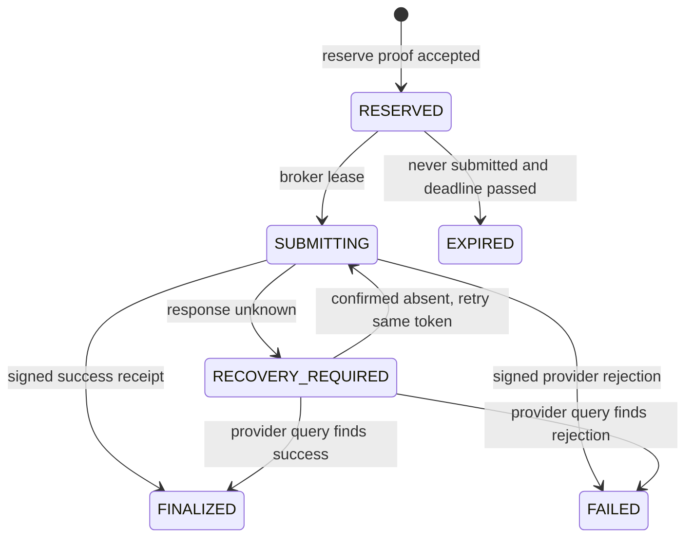

# DeploySeal — build context

**Working title:** DeploySeal  
**Flagship pitch:** *Deploy regulated AI without exposing what you ship: Midnight proves every private policy gate and makes the real AWS deployment exactly once—even through a lost response.*  
**Target:** AKINDO Midnight Buildathon, Wave 1  
**Research cutoff:** 12 September 2026 (UTC)

**Document status:** design context only. The current checkout is still a Vite/React, server-package, and Hardhat starter; it does not yet contain the Compact contract, broker, workflow, or deployment described below.

## 0. Current checkout and prerequisites

The repository was inspected on 12 September 2026. The evidence is intentionally recorded here so the target architecture is not mistaken for shipped functionality.

| Area | Current evidence | Consequence |
|---|---|---|
| Root | `README.md` is only a title; `context.md` and `plan.md` are the design artifacts | The first implementation milestone must establish the root workspace and release evidence files |
| Client | `client/` is the untouched Vite/React starter with `build` and `lint` scripts | Replace the demo screen with the release console, retaining the existing Vite stack |
| Server | `server/` has a package manifest but no runtime entrypoint | Add only the coordinator/broker boundary required by the vertical slice |
| Contracts | `contracts/` is a Hardhat Counter sample; no Compact source or Midnight dependency exists | Keep the sample green while adding the separate Compact toolchain |
| Secrets | `client/.env` and `contracts/.env` are empty, ignored placeholders | No credential is currently available or required for local synthetic tests |
| Local tools | Node 24.6.0, npm 11.6.2, pnpm, Docker, and Foundry are available | Pin the versions used by CI before relying on them |

The real path additionally needs a Compact compiler/local-dev or Testkit setup, a funded Midnight wallet and Preprod endpoints, GitHub workflow permissions with OIDC and artifact-attestation support, and an isolated AWS account with scoped CloudFormation, CloudTrail, KMS, and Nitro access. Those credentials, private policy/evidence, cloud account, network funds, and repository-admin permissions must come from the project owner; until then, use synthetic fixtures and the local broker/provider emulator.

## 1. Executive decision

DeploySeal is the recommended submission.

It is a confidential, multi-party release-control protocol for regulated AI and software. A deployment is authorized only when a Compact proof establishes that a specific GitHub-built artifact satisfies a current private policy: supply-chain provenance, vulnerability limits, model-evaluation thresholds, data-residency rules, and required approvals. None of the underlying SBOM, CVEs, scores, thresholds, approver identities, or policy clauses becomes public. A one-use Midnight reservation is then bound to one AWS CloudFormation operation, and the actual provider outcome is returned as a signed receipt.

The winning demonstration is deliberately sharper than the total architecture:

1. A real GitHub Actions run produces one artifact, OIDC identity, and artifact attestation.
2. Compact proves that the exact artifact and exact AWS target satisfy a committed confidential policy.
3. The contract reserves one `operation_id` and prevents replay or policy drift.
4. An attested broker calls one real CloudFormation change set with `ClientRequestToken = operation_id`.
5. The worker is killed after AWS accepts the operation but before the client receives a response.
6. A retry recovers by the same operation ID; it does not create another deployment.
7. The UI shows one AWS effect, one finalized Midnight operation, and one KMS-signed receipt—while the private evidence remains undisclosed.

This is not a generic “ZK compliance dashboard.” The hard claim is: **one hidden-policy authorization, one external deployment effect, one durable receipt, including across a lost response.**

## 2. Why this is groundbreaking

Modern deployment gates force every sensitive fact into one control plane. Security sees the full SBOM and CVE list; model-governance systems ingest proprietary evaluation data; cloud administrators see target and residency rules; an approval database accumulates who approved what. Agentic release automation makes this concentration more dangerous: a machine can act quickly, but the organization still needs provable limits and an accountable outcome.

DeploySeal separates four questions that current systems collapse:

| Question | DeploySeal answer |
|---|---|
| Did the artifact satisfy policy? | Compact proves the private predicates against a public policy root. |
| Was this exact operation authorized once? | A one-use, operation-bound nullifier/reservation is recorded on Midnight. |
| Did the cloud side effect occur once? | AWS's native idempotency token and durable query path make retries safe. |
| Can an auditor verify the outcome? | A KMS/HSM-signed receipt binds the permit to actual target, digest, provider operation, and status. |

The result is a new trust shape: independent evidence and approval holders can jointly authorize an action without creating a new party that learns everything. Midnight is the neutral policy/state surface; AWS remains the authority for the external deployment fact; the attested broker bridges them without pretending a blockchain transaction can be physically atomic with a cloud API.

## 3. State of the field

### 3.1 Live WaveHack field snapshot

The [live AKINDO Products tab](https://app.akindo.io/wave-hacks/jaMZjqPOBsLXvjdG?tab=products) contained 37 submissions at the research cutoff. The table below records the public card tagline verbatim or near-verbatim, then adds an **inferred** primitive and an apparent-polish assessment. The inference is not a claim about unpublished implementation.

Polish legend:

- **High:** public repository plus a specific, technically differentiated card and/or visible deployment/testing evidence.
- **Medium:** public repository and a coherent use case, but limited evidence from the card alone.
- **Low/unknown:** no public repository or deliverable linked from the product card, or a generic/incomplete card.

| # | Submission | Public pitch | Inferred Midnight primitive | Apparent polish |
|---:|---|---|---|---|
| 1 | NightHire | Privacy-preserving progressive-disclosure hiring | Selective credential disclosure | Low/unknown; no linked artifact |
| 2 | WhisperScore | Prove qualification without exposing a life history | Private credit/eligibility predicate | Medium; repo linked |
| 3 | PollPower Energy Protocol | Global financial infrastructure with stability and humanity | Meter attestations and private settlement | High; repo, hardware/integration claims |
| 4 | Vantage | Private credit-exposure oracle | ZK exposure/solvency proof | Medium-high; specific repo |
| 5 | datum | Solvency at realizable exit prices without publishing positions | Private portfolio proof and stress valuation | High; unusually specific repo |
| 6 | Agentic Finance Studio (AFS) | Institutional sentiment to actionable crypto signals | Agent workflow plus private signals | Medium; repo linked |
| 7 | DIDz DApp System | Private digital identity, AgenticDID, and RWAz | Private DID/credential system | Medium; broad repo |
| 8 | HelixCTW | Storage and retrieval for a private identity system | Encrypted identity storage/commitments | Medium; repo linked |
| 9 | VeilPass | Prove eligibility without revealing the credential | Selective credential predicate | Medium-high; focused repo |
| 10 | ZENITH | “Privacy-first!” | Unclear | Low/unknown; no artifact |
| 11 | Candor (compensation) | Verified, unlinkable, aggregate-only compensation truth; one epoch, one submission | Nullifiers, aggregate disclosure | High; crisp mechanism and repo |
| 12 | VeriHealth | Prove health facts without medical data | Private health credential predicate | High; repo and multi-party flow |
| 13 | ShadowPayroll | Private payroll for DAOs, teams, contractors | Shielded/private payroll | Medium; repo linked |
| 14 | CryptoSure | Privacy-preserving insurance for crypto holders and businesses | Private risk/claim proofs | Medium; repo linked |
| 15 | SoSoAgent Bot | Prices, portfolio, news, and alerts | Agent plus private portfolio data | Medium-low; repo, weak Midnight specificity |
| 16 | Veil | “Private” | Unclear | Low/unknown; no artifact |
| 17 | EduProof | Prove GPA, enrollment, or scholarship eligibility without transcript | Selective academic disclosure | Medium-high; focused repo |
| 18 | ZeroScore | ZK credit and asset verification | Private credit/asset proof | Medium; repo linked |
| 19 | Lamp | Community nominations, milestone funding, ZK-verified releases | Private milestone attestations/escrow | High; full product framing and repo |
| 20 | ZK-Flow | Working-capital lending for Latin American originators and thin-file SMBs | Private underwriting/credit | Low/unknown; no linked artifact |
| 21 | Bounty board | Private work history used to qualify for jobs | Private reputation credential | Low/unknown; no linked artifact |
| 22 | ClearScope | Prove eligibility without revealing private data | Generic selective disclosure | Medium-low; repo, generic pitch |
| 23 | SafeGuard Bot | Risk-aware Telegram crypto insights and sentiment | Agent plus private portfolio/risk | Medium; repo linked |
| 24 | Candor (reserves) | Prove reserves cover the book without customer balances | Private proof of reserves | High; crisp predicate and repo |
| 25 | Alethia | “Proof without exposure” | Generic ZK proof | Medium-low; repo, generic pitch |
| 26 | BATTLESHIP MN | Private strategy game | Hidden game state/commit-reveal | Medium; repo linked |
| 27 | VINPassport | Private digital circularity vehicle passport | Private vehicle credentials/history | High; repository and deployment evidence |
| 28 | Balary | Confidential institutional USDM payroll | Private/shielded payroll | Medium-high; focused repo |
| 29 | DarkStake | Prediction market with private bet size until close | Private commitment/reveal and settlement | High; legible mechanism and tests |
| 30 | Vero | Prove source credibility without identity | Anonymous reputation credential | Medium-high; focused demo repo |
| 31 | TrueMile | Prove vehicle history clears a buyer check without records | Selective vehicle-history predicate | High; focused repo/product UX |
| 32 | Condition | Verifiable conditions for agreements | Private conditional execution | Low/unknown; no linked artifact |
| 33 | HORIZON | “Credit without exposure” | Private credit proof | Medium; repo linked |
| 34 | TacitPay | Private invoicing and settlement, provable on demand | Private invoices and shielded settlement | Low/unknown; no linked artifact |
| 35 | proofFi | Prove creditworthiness without revealing balance | Private credit predicate | Low/unknown; no linked artifact |
| 36 | kymider | Privacy-first loan underwriting | Private underwriting predicate | Low/unknown; no linked artifact |
| 37 | COHORT | “COHORT” | Unclear | Low/unknown; no linked artifact |

### 3.2 Competitive conclusion

The field is dense in four categories: private credit/solvency, identity/eligibility, payments/payroll, and health/vehicle credentials. A polished entry in any of those categories would still look derivative. DeploySeal occupies a less-claimed intersection—private policy, agentic release control, software provenance, TEE-attested execution, and crash-safe external effects.

The closest live comparators are:

- **DarkStake**, for a clear private state transition, replay resistance, and testable settlement.
- **AFS/SafeGuard Bot**, for agentic workflows, but neither card describes a private action-authorization lifecycle.
- **ZK-Flow/Lamp**, for gating a real workflow, but neither targets confidential software/model policy or provider-side exactly-once execution.

DeploySeal must beat DarkStake's demo clarity. The deployment sequence should be understandable without explaining ZK internals: approved, reserved, AWS accepted, response lost, recovered, finalized once.

### 3.3 What has recently won elsewhere

The research set covered recent ETHGlobal, Encode, Devfolio, DoraHacks, ZK/privacy, Zama, and Secret Network winners. Representative sources include [ETHGlobal New York 2025](https://ethglobal.com/events/newyork2025/info/details), [Fern's ETHGlobal NYC prize recap](https://fernhq.com/blog/ethglobal-new-york-2025-fern-api-prize-winners), [Encode London 2025](https://medium.com/@envio_indexer/encode-london-2025-celebrating-envios-hackathon-winners-22f59515f2db), [Encode Hyperliquid 2026](https://li.fi/knowledge-hub/encodes-hyperliquid-hackathon-winners-january-2026), [ZK Hack Berlin projects](https://devfolio.co/projects/zkanticheat-74ee), [ETH Dublin 2025 winners](https://dorahacks.io/hackathon/ethdublin2025/winner), [Zama PL Genesis winners](https://www.zama.org/post/zama-at-the-pl-genesis-hackathon-the-winning-projects), and [HackSecret 5 winners](https://scrt.network/blog/the-winners-of-hacksecret-5).

The recurring judging patterns were more useful than the project names:

1. **A complete path beats a clever primitive.** Winning demos connect input, proof, state change, and user-visible outcome.
2. **Crypto complexity disappears.** The proof is part of the product interaction, not a separate “generate ZK proof” science-fair screen.
3. **A recognizable integration makes the claim real.** Live APIs, brands, standard datasets, or deployed testnet addresses reduce judge uncertainty.
4. **The privacy harm is specific.** “Privacy is good” loses to “this CVE list, evaluation score, approval chain, and residency rule cannot be pooled in one release database.”
5. **Failure is demonstrated, not described.** Replay, stale state, conflict, expiry, and recovery are visible demo states.
6. **Mechanisms are inspectable.** Repositories, contract addresses, verifier scripts, test vectors, metrics, and reproducible setup carry disproportionate weight.
7. **Reliability is part of the pitch.** Good entries show timeout behavior, malformed inputs, recovery, and explicit trust boundaries.

DeploySeal is designed around all seven: GitHub and AWS are recognizable; the cryptography sits behind a “release” action; the worker crash is a live failure; the state machine and receipt are inspectable; private evidence has a concrete commercial/security reason to remain split.

### 3.4 Adjacent cutting edge and the chosen fusion

Current adjacent systems show five important directions:

- **General-purpose and private proving:** OpenVM and SP1 push verifiable computation and private proving beyond hand-written circuits ([OpenVM v1](https://www.axiom.xyz/blog/openvm-v1), [SP1 private proving](https://blog.succinct.xyz/private-proving/)).
- **ZK coprocessors and proof of live data:** Brevis and related systems make historical/off-chain data verifiable, while zkTLS systems such as Primus attest web data without publishing sessions ([Brevis ProverNet](https://blog.brevis.network/2026/01/06/brevis-provernet-mainnet-and-brev-are-live/), [Primus technical introduction](https://docs.primuslabs.xyz/primus-network/tech-intro/)).
- **TEE + ZK hybrid architecture:** confidential execution can hold credentials and interact with external services; ZK makes selected statements portable and publicly verifiable. SP1's 2FA work is a useful pattern ([SP1 2FA](https://blog.succinct.xyz/sp1-2fa/)).
- **Agent-native authorization:** EIP-7702, account abstraction, x402, and ERC-8004 point toward autonomous actors with programmable identity, payment, and reputation ([EIP-7702](https://eips.ethereum.org/EIPS/eip-7702), [x402](https://www.coinbase.com/developer-platform/discover/launches/x402), [ERC-8004](https://eips.ethereum.org/EIPS/eip-8004)).
- **Portable credentials and policy envelopes:** W3C VC 2.0 and OpenID4VP define interoperable issuance/presentation boundaries ([W3C VC 2.0](https://www.w3.org/TR/vc-data-model-2.0/), [OpenID4VP](https://openid.net/specs/openid-4-verifiable-presentations-1_0.html)).

DeploySeal deliberately fuses the third and fourth directions with Midnight. The TEE is not treated as a truth oracle: its measurement and keys are explicit trust anchors, while the Compact proof and public state make the authorization independently auditable. The agent cannot simply present an opaque TEE result; it must satisfy a versioned Midnight policy and consume a one-use operation permit.

## 4. Midnight ecosystem signals

Midnight's public materials consistently emphasize privacy-by-design applications, selective predicates, reusable reference implementations, and complete contract/test/UI delivery. The network is live, and its ecosystem announcements point toward enterprise-grade integrations and real-world adoption rather than isolated proof toys ([mainnet announcement](https://midnight.network/blog/midnight-network-is-live), [request for startups](https://midnight.network/request-for-start-ups)).

Partnership signals include [Google Cloud collaboration](https://midnight.network/blog/google-cloud-midnight-ecosystem-collaboration) and public ecosystem relationships involving Vodafone Pairpoint, MoneyGram, eToro, Worldpay, Bullish, and AlphaTON. These should be read as directional signals—not endorsements of DeploySeal. The direction is clear: confidential commercial coordination, identity/attestation, payments, and deployable enterprise infrastructure.

Midnight's own hackathon retrospectives reward precise disclosure boundaries, commitments/nullifiers, unique salts, sound access control, and end-to-end delivery ([July hack winners](https://midnight.network/blog/celebrating-seven-winners-from-mlh-x-midnight-july-hack), [HILO winners](https://midnight.network/blog/hilo-hackathon-winners-keep-privacy-on-track-across-four-categories)).

The [AKINDO rules and rubric](https://app.akindo.io/wave-hacks/jaMZjqPOBsLXvjdG) set the concrete target:

| Criterion | Weight | DeploySeal evidence |
|---|---:|---|
| Engineering & Implementation | 40% | Compiling Compact contract; private-state witnesses; public ledger roots/nullifiers/state machine; GitHub→Midnight→AWS end-to-end integration; organized Apache-2.0 repo and README. |
| Quality Assurance & Reliability | 15% | Unit/property/integration/E2E/chaos/privacy tests; reproducible lost-response recovery; mutation tests and deterministic vectors. |
| Product & Vision | 15% | Regulated agentic release control with a clear adoption wedge and explicit trust model. |
| User Experience & Design | 15% | One release screen; policy facts displayed as pass/fail disclosures; no proof jargon required. |
| Communication | 10% | A short, falsifiable demo narrative and public evidence pack. |
| Business Development & Viability | 5% | GitHub Actions + AWS CloudFormation wedge; later adapters gated by a strict capability contract. |

There is also a technical gate: at least one Compact contract must compile. The repository, deck, demo video, Apache-2.0 Midnight code, and GitHub `midnightntwrk` label are submission requirements.

## 5. The product

### 5.1 Users and roles

| Role | Holds privately | Publishes or attests |
|---|---|---|
| Policy governor | Policy document, salt, thresholds, allowed targets, disclosure rules | Versioned policy root, epoch, activation/revocation metadata |
| Security attestor | SBOM assessment, CVE facts, signing key | Signed fact commitment and validity/revocation witness |
| Model evaluator | Evaluation suite, scores, methods | Signed score commitment/schema version |
| Residency/compliance approver | Region/legal constraints and approval | Signed constraint/approval commitment |
| Release workflow | GitHub OIDC token, artifact attestation, artifact digest, target request | Operation intent and proof transaction |
| Midnight contract | No plaintext evidence | Policy roots, key roots, nullifiers, operation state, receipt hash |
| Nitro broker | Proof package, permitted operation fields, AWS credentials | Attestation document and KMS-signed provider receipt |
| Auditor | Only fields authorized by disclosure policy | Verification result and disclosure receipt |

### 5.2 Private policy statement

For the demonstration, define `PolicyV1` as canonical CBOR with fixed integer keys and a domain separator. Its private contents include:

- allowed immutable GitHub repository IDs and workflow references;
- allowed AWS account, region, stack, and environment;
- maximum permitted vulnerability severity/count and scanner/schema version;
- minimum model-evaluation scores by named benchmark/version;
- allowed data-residency class and model/data handling category;
- required approval roles and quorum;
- accepted OIDC issuer/audience and artifact-attestation issuer/builder;
- permit TTL, policy epoch, broker measurement allowlist, and receipt-key allowlist;
- which fields may be selectively disclosed to which audit role.

`policyRoot = persistentCommit(domainSeparatedCanonicalPolicy, policySalt)`, where `domainSeparatedCanonicalPolicy` encodes `DeploySeal/PolicyV1` as part of the committed value. The domain is not a third argument to `persistentCommit`.

Never call `disclose(policy)` or `disclose(policySalt)`. Only the root, epoch, and intentionally public metadata reach the ledger.

### 5.3 Canonical operation identity

The operation ID must be recomputed from canonical bytes; it is never accepted as an arbitrary caller string.

```text
operationCore = {
  version,
  providerId,              // includes AWS account and region
  immutableRepositoryId,   // GitHub numeric repository_id
  runId,
  runAttempt,
  commitSha,
  artifactDigest,
  targetId,                // CloudFormation stack/change-set identity
  environmentId,
  policyEpoch,
  nonce128
}

operation_digest = SHA-256(
  "DeploySeal\0OperationV1\0" || canonicalCBOR(operationCore)
)

operation_id = lowercase_hex(operation_digest)
```

Generate `nonce128` once and persist it before reservation. Retries reuse it. A changed run attempt, artifact, target, policy epoch, or nonce is a new operation. If the product needs “same intent globally at most once,” maintain a separate intent nullifier over repository, target, environment, commit, and digest.

AWS specifies `ClientRequestToken` as 1–128 characters matching `[a-zA-Z0-9][-a-zA-Z0-9]*` and describes it as the identifier to reuse for `ExecuteChangeSet` retries. Lowercase hexadecimal encoding of the 32-byte digest is a 64-character, fully alphanumeric token, so it satisfies that pattern without a custom alphabet. Lock both `operation_digest` and `operation_id` with a golden vector and reject any token that fails the provider pattern ([AWS API reference](https://docs.aws.amazon.com/AWSCloudFormation/latest/APIReference/API_ExecuteChangeSet.html)).

## 6. Why Midnight is structurally necessary

### 6.1 The normal-database removal test

A database can store approvals, call AWS, and add a unique index. It cannot meet the product requirement without changing the trust model:

- One operator must collect the SBOM, CVEs, model scores, residency rules, policy thresholds, and approver graph.
- Independent organizations must trust that operator to evaluate the hidden policy honestly.
- Auditors receive either the operator's assertion or the underlying sensitive data.
- A database signature proves what that operator recorded, not that a shared confidential predicate was satisfied.

Midnight replaces the evidence-aggregating operator with a public, deterministic verification surface. Compact proves the conjunction of private facts against public versioned roots; ledger state atomically consumes the one-use authorization; selective disclosure reveals only authorized fields. The AWS broker is still trusted for AWS interaction, but it cannot mint a valid Midnight authorization or silently change the bound artifact/target.

If the private facts were made public, or if one organization already controlled and was trusted with all evidence, DeploySeal would not need Midnight. Those are explicit non-target cases.

### 6.2 Midnight primitives and their necessity

| Primitive | Use | Why it is not optional |
|---|---|---|
| Compact circuits | Validate policy root opening, evidence commitments, signatures/Merkle membership, thresholds, target binding, expiry, and transition rules | Without a circuit, the release service merely asserts that secret policy passed. |
| Private witnesses | Policy plaintext/salt, SBOM/CVE facts, model scores, approvals, Merkle paths, OIDC/attestation-derived facts | Publishing them defeats the product's security/commercial purpose. Witnesses are untrusted inputs; every relied-on value must be constrained. |
| Public ledger state | Policy/key/broker roots and epochs, consumed nullifiers, operation state, receipt hash | Makes the authorization neutral, ordered, replay-resistant, and auditable across parties. |
| Selective disclosure | Auditor-approved opening of a named subset with proof of relation to the operation/policy | Allows incident/regulatory review without turning every release into public evidence. |
| Commitments and unique salts | Bind hidden policy/evidence to public roots without dictionary leakage | Unsalted or reused salts make low-entropy policy facts guessable/linkable. |
| Nullifiers | One-use operation and optional approval/evidence consumption | Prevents proof replay and concurrent duplicate reservation without revealing evidence. |
| Block time | Permit expiry and recovery deadlines | Deadlines must use chain time, not an agent or broker clock. |

ZSwap is **not** required in the first winning path. Adding a shielded bounty or payment would distract from the authorization claim. It can be a later module for private service payments or slashing, but should not appear as decorative scope.

### 6.3 Ledger state, witnesses, and the disclosure boundary

Midnight's architecture separates public ledger state from user-held private state. A Compact witness runs off-chain and can read/update the user's private state; it is not trusted simply because it is called a witness. The circuit must recompute commitments, bind every private field to signed/committed public anchors, and assert all predicates. See the [Compact documentation](https://docs.midnight.network/compact), [end-to-end architecture](https://docs.midnight.network/concepts/how-midnight-works/end-to-end-architecture), [ledger concepts](https://docs.midnight.network/concepts/ledgers), and [semantics](https://docs.midnight.network/concepts/how-midnight-works/semantics).

`disclose()` is an explicit compiler-tracked transition from private-derived data into the public transcript; it is not a general encryption or selective-sharing API. Minimize every disclosure and test the public transcript/ledger projection. See [explicit disclosure](https://docs.midnight.network/compact/reference/explicit-disclosure) and [smart-contract security](https://docs.midnight.network/compact/smart-contract-security).

Current Compact standard-library primitives include persistent/transient hashing and commitments, Merkle path verification, block-time comparisons, and in-circuit Jubjub Schnorr and secp256k1 ECDSA verification. Signature results must be asserted and message hashes must be bound to the actual structured message ([standard library](https://docs.midnight.network/compact/standard-library), [detailed exports](https://docs.midnight.network/compact/standard-library/exports)).

## 7. Protocol state machine

### 7.1 Public contract state

```text
policyRootByEpoch: Map<PolicyEpoch, Bytes<32>>
activePolicyEpoch: Counter
attestorRootByEpoch: Map<KeyEpoch, Bytes<32>>
brokerMeasurementRootByEpoch: Map<BrokerEpoch, Bytes<32>>
receiptKeyRootByEpoch: Map<ReceiptKeyEpoch, Bytes<32>>

operationState: Map<OperationId, OperationRecord>
operationNullifiers: Set<Bytes<32>>
intentNullifiers: Set<Bytes<32>>              // optional strict rerun control
disclosureNullifiers: Set<Bytes<32>>
```

`OperationRecord` contains only the fields intentionally declared public. Default public projection:

```text
{
  operationDigest,
  operationId,
  policyEpoch,
  intentCommitment,
  status,
  reservedAt,
  expiresAt,
  brokerMeasurementEpoch,
  receiptHash?,
  finalizedAt?
}
```

The protocol keeps both representations: `operation_digest` is the 32-byte canonical hash used by Compact/state fixtures, while `operation_id` is the provider-safe string derived from it above. Every implementation and golden vector must derive the same pair; neither value may be accepted as an arbitrary caller-supplied replacement for the other.

Do not publish the operation preimage: repository, target, environment, commit, or artifact digest remain private by default. The `operation_digest`/`operation_id` pair is an intentional pseudonymous public identifier required for state lookup and provider recovery; it must not be treated as a disclosure of its preimage.

### 7.2 States



Important invariants:

- There is at most one public operation record per `operation_id`.
- A consumed operation nullifier is never removed.
- Bound fields are immutable after `RESERVED`.
- `RESERVED → EXPIRED` is allowed only if no provider submission occurred.
- An accepted or unknown provider operation is never blindly expired.
- Finalization is idempotent for the same receipt hash and rejects a different receipt hash.
- No transition trusts a client-provided status without a valid broker/provider receipt.

The broker maintains a local durable mirror with compare-and-set transitions. Midnight is the authorization/audit state; AWS is the external-effect authority. Recovery reconciles the two rather than claiming cross-system atomicity.

### 7.3 Core circuits

1. `registerPolicy(newRoot, epoch, activationTime)` — governance-authorized, monotonic policy update.
2. `rotateAttestorRoot(newRoot, epoch)` — monotonic key/root rotation with explicit effective time.
3. `reserve(operationPublic, operationPrivate)` — proves policy/evidence/approval/OIDC/artifact/target predicates and inserts the nullifier atomically.
4. `markSubmitting(operationDigest, brokerLeaseCommitment)` — binds an authorized broker attempt without exposing credentials.
5. `finalize(operationDigest, receiptPublic, receiptPrivate)` — verifies receipt key membership/signature and binding; stores receipt hash.
6. `markFailed(operationDigest, signedFailure)` — records a provider-authenticated terminal rejection.
7. `expireUnsubmitted(operationDigest)` — uses chain block time and proves no submission marker.
8. `recordDisclosureRequest(operationDigest, selectorCommitment, purposeHash)` — records a purpose-bound request; selected audit values are delivered in an off-chain disclosure bundle verified against the committed operation.

An auditor-only disclosure must not be implemented by calling `disclose()` on a public ledger field. In Compact, `disclose()` marks a value as allowed to enter the public transcript/ledger; recipient-scoped disclosure is an off-chain proof/opening flow with only its request or receipt commitment recorded publicly.

The first build can merge `markSubmitting` into the broker flow if the contract/API shape demands it, but must preserve the “never expire accepted-unknown” invariant.

## 8. External trust boundary

DeploySeal does not prove that AWS, GitHub, a scanner, an evaluator, or a human approver is honest. It proves that:

- signed facts came from keys included in the relevant committed root at the bound epoch;
- those facts satisfy the committed policy;
- the proof is bound to an exact artifact, workflow identity, target, and operation;
- the operation permit is unique and state transitions are valid;
- the returned receipt came from an allowed broker/receipt key and matches the reserved intent.

Explicit trust anchors:

- GitHub OIDC issuer keys and exact claim policy;
- GitHub/Sigstore artifact-attestation trust root and builder identity;
- security scanner and model evaluator keys/schema versions;
- policy-governance keys and rotation rules;
- Nitro Enclave measurement allowlist;
- KMS receipt-key policy;
- AWS CloudFormation and CloudTrail as the external deployment record.

AWS Nitro attestation can establish that a known enclave image is running, but it is not a proof that the code is bug-free. Pin measurements, disallow debug measurements, bind KMS policy to the attestation conditions, and expose those assumptions in the README.

## 9. GitHub and artifact binding

Validate the OIDC token signature and require exact values for:

- issuer `https://token.actions.githubusercontent.com`;
- configured audience;
- immutable numeric `repository_id` (not mutable owner/name alone);
- `run_id`, `run_attempt`, commit SHA, and exact environment;
- allowlisted `workflow`/`workflow_ref` (and `job_workflow_ref` when reusable workflows are used);
- bounded `iat`, `nbf`, and `exp`;
- any actor/ref/event claims required by policy.

GitHub documents granular OIDC claim policies including immutable repository IDs ([OIDC reference](https://docs.github.com/en/actions/reference/security/oidc)). Artifact attestation must be signature-valid and bind its subject digest to `artifactDigest`, with the same repository, workflow/builder, commit/run, and trusted issuer ([artifact attestations](https://docs.github.com/en/actions/concepts/security/artifact-attestations)). Never accept a digest-only statement or a repository-name-only binding.

For the first circuit, parsing large JWT/DSSE documents directly in Compact may be impractical. Use a clearly specified attestation-adapter boundary:

1. a verifier validates the original bundle against pinned roots;
2. it emits a canonical, signed `BuildFactV1` containing only exact required claims plus hashes of original evidence;
3. Compact verifies the adapter key's membership/signature and binds every `BuildFactV1` field to the operation and private policy;
4. original bundles remain encrypted/content-addressed for audit.

The adapter is an explicit trust-reduction step, not an invisible oracle. A stretch goal is direct in-circuit verification of the compact signature/hash path.

## 10. Receipt format and exactly-once semantics

Canonical `ReceiptV1`:

```text
{
  version,
  operationDigest,
  operationId,
  permitHash,
  providerId,
  providerOperationId,
  actualTarget,
  actualArtifactDigest,
  status,
  providerCompletionTime,
  receiptKeyId,
  cloudTrailEventHash,
  enclaveMeasurement
}
```

The broker signs the domain-separated canonical hash with an allowed KMS key. `finalize` verifies key membership, signature, operation/permit binding, actual target/digest equality, allowed measurement, and state transition before recording `receiptHash`.

Exactly-once must be described precisely:

- Midnight uniqueness gives **one logical authorization record** per operation ID.
- CloudFormation's native client token gives **at-most-one provider execution for retries of that same request**, subject to AWS's documented semantics.
- Durable query/reconciliation gives **eventual knowledge of the provider outcome** within the retention/recovery window.
- Contract finalization gives **one durable receipt hash** per operation.
- A materially different intent, run attempt, policy epoch, or nonce is a different operation unless the optional intent-nullifier policy forbids it.

Do not claim distributed atomicity or universal exactly-once delivery. Claim exactly one effect for the bound operation under the explicit provider-idempotency and retention assumptions.

## 11. Privacy and leakage budget

### Public by default

- versioned roots and epochs;
- pseudorandom operation/intent commitments or nullifiers;
- the pseudonymous `operation_digest`/`operation_id` pair required for lookup and provider recovery;
- coarse operation status;
- chain timestamps/deadlines;
- receipt hash and receipt-key epoch.

### Private by default

- raw OIDC token and artifact-attestation bundle;
- repository, workflow, actor, target, environment, commit, and artifact digest unless disclosed;
- SBOM, packages, CVEs, scanner output, model benchmarks/scores, policy thresholds;
- residency facts, approver identities/signatures, and internal policy text;
- AWS credentials, KMS/HSM private material, raw Nitro attestation, and full receipt.

### Side channels to control

- proof size/time varying with secret list length;
- distinct rejection messages for different private predicate failures;
- API timing revealing which gate failed;
- logs, traces, browser telemetry, crash reports, and CI artifacts containing tokens/evidence;
- correlation through reused salts, nonces, operation IDs, policy roots, or disclosure requests;
- public status granularity that reveals approval timing or organization workflow.

Use fixed-size bounded evidence slots for the demo circuit, uniform external errors (`POLICY_NOT_SATISFIED`), padded/batched client behavior where practical, and a log-field allowlist.

## 12. Why it beats the alternatives

The six final concepts all passed an adversarial Midnight-necessity and novelty review:

| Rank | Concept | Surviving differentiator | Why it did not win |
|---:|---|---|---|
| 1 | **DeploySeal** | Private multi-party policy joined to crash-safe real cloud execution | Winner |
| 2 | FlexSeal | Private industrial demand-response delta plus multi-meter quorum and shielded settlement | Excellent physical-world demo; larger sensor/oracle credibility burden |
| 3 | Covenant Relay | Deterministic freight evidence, conflict freeze, partial capture/refund | Very legible; closer to existing private payment/condition entries |
| 4 | TrialGate | Neutral global duplicate-enrollment invariant with private clinical facts | Strong necessity; healthcare credential field is crowded |
| 5 | RightRelay | Offline, transferable item-bound aftercare right | Highly novel; secure-element hardware trust complicates proof of production readiness |
| 6 | MosaicClear | Hidden double-finance prevention for buyer-approved receivables | Strong finance wedge; live field is saturated with credit/invoice/solvency projects |

The final meta-judge scored DeploySeal highest on the rubric-heavy dimensions: engineering 9.8/10, QA 9.8/10, novelty 9.0/10, Midnight necessity 9.7/10, demo clarity 8.8/10, and field/winner edge 9.8/10. Its main weakness is breadth. The mitigation is to ship one narrow, real GitHub→Compact→CloudFormation path and treat every other provider/policy module as post-demo roadmap.

## 13. Definition of success

The submission is only ready when a cold evaluator can:

1. clone the public Apache-2.0 repository;
2. compile the Compact contract with pinned versions;
3. run unit/property/integration tests locally;
4. inspect deterministic policy/operation/receipt test vectors;
5. run or verify a Preprod deployment and contract address;
6. trigger the GitHub workflow on the demo artifact;
7. observe one Compact reservation and one AWS change-set execution;
8. reproduce the lost-response recovery with no duplicate effect;
9. verify the KMS-signed receipt independently;
10. inspect the public ledger/transcript and confirm that no secret policy/evidence field leaked;
11. see a stale-policy, replay, wrong-artifact, and wrong-target attempt fail;
12. understand the trust assumptions and non-goals from the README without speaking to the team.

## 14. Non-goals for the winning release

- No generic multi-cloud abstraction before the AWS path is complete.
- No claim that a blockchain transaction is atomic with AWS.
- No claim that a TEE, scanner, evaluator, or approver is intrinsically truthful.
- No custom zkML model inference circuit in the critical path; signed model-evaluation facts are enough for Wave 1.
- No decorative token, DAO, marketplace, or ZSwap payment.
- No public repository/target/digest unless the user explicitly chooses to disclose it.
- No in-place policy mutation; every change creates a new epoch/root.
- No “exactly once” claim outside the defined operation/token/retention boundary.

## 15. Primary source index

### Midnight

- [Midnight developer documentation](https://docs.midnight.network/)
- [Compact](https://docs.midnight.network/compact)
- [Compact standard library](https://docs.midnight.network/compact/standard-library)
- [Detailed standard-library exports](https://docs.midnight.network/compact/standard-library/exports)
- [Smart-contract security](https://docs.midnight.network/compact/smart-contract-security)
- [Explicit disclosure](https://docs.midnight.network/compact/reference/explicit-disclosure)
- [End-to-end architecture](https://docs.midnight.network/concepts/how-midnight-works/end-to-end-architecture)
- [Ledgers](https://docs.midnight.network/concepts/ledgers)
- [Transaction semantics](https://docs.midnight.network/concepts/how-midnight-works/semantics)
- [Kachina](https://docs.midnight.network/concepts/kachina)
- [ZSwap](https://docs.midnight.network/concepts/zswap)
- [Release notes](https://docs.midnight.network/relnotes/overview)
- [Compact toolchain release notes](https://docs.midnight.network/relnotes/overview)

### Buildathon and ecosystem

- [AKINDO Midnight Buildathon](https://app.akindo.io/wave-hacks/jaMZjqPOBsLXvjdG)
- [Live Products tab](https://app.akindo.io/wave-hacks/jaMZjqPOBsLXvjdG?tab=products)
- [Midnight mainnet is live](https://midnight.network/blog/midnight-network-is-live)
- [Request for startups](https://midnight.network/request-for-start-ups)
- [Google Cloud collaboration](https://midnight.network/blog/google-cloud-midnight-ecosystem-collaboration)
- [July hack winners](https://midnight.network/blog/celebrating-seven-winners-from-mlh-x-midnight-july-hack)
- [HILO hackathon winners](https://midnight.network/blog/hilo-hackathon-winners-keep-privacy-on-track-across-four-categories)

### Deployment/provenance

- [AWS CloudFormation `ExecuteChangeSet` and `ClientRequestToken`](https://docs.aws.amazon.com/AWSCloudFormation/latest/APIReference/API_ExecuteChangeSet.html)
- [AWS Nitro Enclaves documentation](https://docs.aws.amazon.com/enclaves/latest/user/nitro-enclave.html)
- [GitHub Actions OIDC reference](https://docs.github.com/en/actions/reference/security/oidc)
- [GitHub artifact attestations](https://docs.github.com/en/actions/concepts/security/artifact-attestations)
- [Sigstore](https://www.sigstore.dev/)

### Recent winner research

- [ETHGlobal New York 2025](https://ethglobal.com/events/newyork2025/info/details)
- [Fern API prize winners at ETHGlobal NYC](https://fernhq.com/blog/ethglobal-new-york-2025-fern-api-prize-winners)
- [Encode London 2025 winners](https://medium.com/@envio_indexer/encode-london-2025-celebrating-envios-hackathon-winners-22f59515f2db)
- [Encode Hyperliquid Hackathon winners](https://li.fi/knowledge-hub/encodes-hyperliquid-hackathon-winners-january-2026)
- [ZK-AntiCheat](https://devfolio.co/projects/zkanticheat-74ee)
- [ETH Dublin 2025 winners](https://dorahacks.io/hackathon/ethdublin2025/winner)
- [Zama PL Genesis winners](https://www.zama.org/post/zama-at-the-pl-genesis-hackathon-the-winning-projects)
- [HackSecret 5 winners](https://scrt.network/blog/the-winners-of-hacksecret-5)

## 16. Terminology

- **Commitment:** a hiding, binding digest of private data and randomness.
- **Nullifier:** a deterministic pseudorandom value published/consumed to make a private right or operation one-use.
- **Witness:** off-chain private input/state supplied to a Compact circuit; it is not trusted unless constrained by the circuit.
- **Policy epoch:** immutable version number for one committed policy root and its key/trust configuration.
- **Operation ID:** canonical identifier binding one provider request to one build, artifact, target, policy epoch, and nonce.
- **Receipt:** signed statement of the actual provider outcome, checked against the reserved intent.
- **Accepted-unknown:** the broker knows a request may have reached AWS but lacks the response; recovery must query/retry the same idempotency key and must not expire or create a new key.
- **Selective disclosure:** proving or revealing only an authorized subset/derived fact, not publishing the complete underlying evidence.
