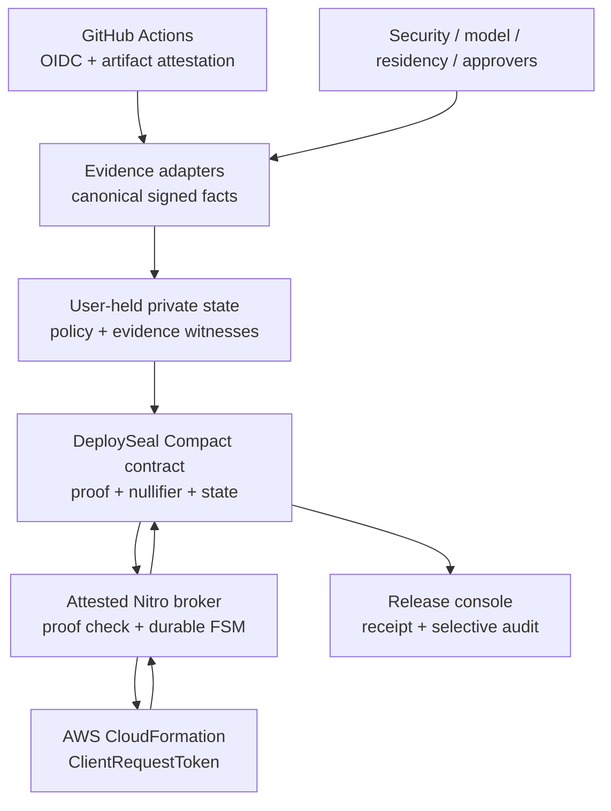

# DeploySeal — implementation plan

**Goal:** ship a reproducible GitHub → Midnight Compact → Azure ARM path that proves confidential release policy, consumes a one-use operation authorization, survives an intentionally lost Azure response without duplicate execution, and finalizes one verifiable provider receipt.

This plan is milestone-ordered. Each milestone has an objective, tasks, exit criteria, and judge-visible evidence. The original AWS wording is retained in alternate-provider sections for comparison; the active implementation is Azure.

## Status snapshot — 13 September 2026

The narrow Azure vertical slice is implemented and live-tested: real ARM deployment/tag effect, operation-name idempotency, CVM MAA verification with measurement and challenge binding, Key Vault receipt signing, SQLite crash recovery, GitHub BuildFact publication, signed EvidenceFact verification, and generated Compact operation/receipt bindings. The live crash run recovered one ARM effect, finalized one Preprod operation, verified its receipt, and rejected replay. Independent SBOM/model/residency/approval issuers, HSM/Secure Key Release, and authenticated multi-host storage remain explicit external integrations and are not fabricated by this repository.

## 0. Current baseline and required inputs

This is an implementation plan, not a claim that every external dependency is owned by the repository. The checkout contains a Vite/React release console, a durable coordinator/broker, a compiling Compact reserve/finalize slice under `contracts/deployseal/`, a credential-gated MidnightJS/Preprod client, GitHub OIDC/attestation adapters, Azure ARM/Key Vault/MAA adapters, an alternate AWS adapter, signed EvidenceFact verification, and an independent receipt verifier. The funded Midnight contract deployment and public Azure cloud path are operational; independent EvidenceFact issuers, production HSM/Secure Key Release, and multi-host storage remain outside this repository. The current local smoke checks are:

```sh
npm --prefix client run build
npm --prefix client run lint
npm --prefix contracts/deployseal test
npm --prefix server test
```

Those checks cover only the starter baseline. The DeploySeal acceptance test below is not satisfied until the milestone evidence exists.

| Input | Needed for | Who must provide it | Safe fallback |
|---|---|---|---|
| Compact compiler, compatible MidnightJS line, and local-dev/Testkit | Contract compile and deterministic local tests | Implementation environment; resolve from the official example and pin it | Synthetic protocol tests can start first; no Compact completion claim |
| Midnight wallet, faucet/funds, network, indexer, and proof endpoints | Preprod deploy and judge-visible transactions | Project owner or network operator | Local-dev/Testkit only |
| GitHub repository/workflow permissions, OIDC configuration, and artifact-attestation capability | Real BuildFact generation | Repository owner/admin | Signed synthetic BuildFact fixtures |
| Isolated AWS account/region, demo stack, scoped IAM role, CloudTrail access, KMS key, and Nitro-capable host | Real provider effect, receipt, and attestation demo | AWS account owner | Local idempotent-provider emulator; never use an unapproved account |
| One repository, artifact, target, policy vector, and disclosure policy | Reproducible acceptance test | Product owner; use synthetic defaults if no choice is supplied | The defaults must be recorded at Milestone 0 |

Credentials and private evidence are never committed or pasted into the repository. The empty ignored `.env` files may hold local endpoints during development, but secret values belong in the runtime secret store or short-lived environment, not in source, logs, browser storage, or CI artifacts.

## 1. Winning acceptance test

The build is successful when this exact scenario passes:

```gherkin
Given a versioned private policy committed on Midnight
And independent signed facts for supply chain, vulnerabilities,
    model evaluation, residency, and required approvals
And a GitHub Actions OIDC identity and artifact attestation
    bound to artifact digest D
When the workflow requests deployment of D to AWS target T
Then a Compact proof authorizes exactly that artifact and target
And Midnight records one RESERVED operation with a one-use nullifier
When the attested broker executes the CloudFormation change set using
    ClientRequestToken = operation_id
And the broker process dies after AWS accepts but before it returns
When the same operation is retried
Then the broker queries/retries with the same token
And AWS contains exactly one resulting deployment effect
And Midnight contains exactly one FINALIZED operation
And both attempts return the same KMS-signed receipt
And the public ledger, logs, API responses, and UI reveal no policy,
    CVE, score, approver, repository, target, or artifact field that
    was not explicitly selected for disclosure
```

The negative twin must also pass: change the artifact digest, target, policy epoch, approval quorum, or a private threshold input and the deployment must stop before AWS invocation.

## 2. System architecture



### 2.1 Trust split

| Component | Trusted for | Not trusted for |
|---|---|---|
| Compact contract | Deterministic private-policy verification, authorization uniqueness, public state transitions | Truth of external attestations or AWS outcome |
| Evidence attestors | Facts within their declared schema/scope | Other attestors' facts or contract transitions |
| GitHub/Sigstore | Workflow and artifact provenance under pinned roots | Policy satisfaction or AWS outcome |
| Nitro broker | Correct AWS request/receipt construction under an allowed measurement | Creating policy authorization or changing bound fields |
| AWS CloudFormation | External infrastructure operation and idempotency semantics | Confidential policy verification |
| KMS receipt key | Authenticity of broker receipt under bound enclave policy | Correctness of Compact proof unless broker verifies it |
| Frontend/API | Orchestration and presentation | Any security decision; all decisions are independently verified |

### 2.2 Repository layout

The layout below is the target state, not the current checkout. Milestone 0 adds the root workspace and migrates the existing `client/`, `server/`, and `contracts/` projects without deleting their working lockfiles until the new workspace checks are green.

```text
deployseal/
├── LICENSE                         # Apache-2.0
├── README.md
├── SECURITY.md
├── THREAT_MODEL.md
├── package.json
├── pnpm-lock.yaml
├── .tool-versions
├── .github/
│   └── workflows/
│       ├── ci.yml
│       ├── attest-demo-artifact.yml
│       └── deployseal-demo.yml
├── contracts/
│   └── deployseal/
│       ├── src/deployseal.compact
│       ├── src/types.compact
│       ├── src/crypto.compact
│       ├── test/
│       ├── fixtures/
│       └── generated/              # generated bindings; policy documented
├── packages/
│   ├── protocol/                   # canonical CBOR, domains, hashes, types
│   ├── private-state/              # witness storage and key handling
│   ├── midnight-client/            # deploy/interact/indexer/proof providers
│   ├── evidence-adapters/          # GitHub, SBOM, model, residency, approvals
│   ├── verifier/                   # independent receipt/disclosure verifier CLI
│   └── test-vectors/               # immutable golden JSON/CBOR/hash fixtures
├── services/
│   ├── coordinator/                # reservation/finalization orchestration
│   └── broker/
│       ├── core/                   # provider-neutral state machine
│       ├── aws-cloudformation/     # the only Wave-1 provider adapter
│       ├── nitro/                  # enclave image and attestation policy
│       └── migrations/
├── apps/
│   └── web/                        # release/audit console
├── infra/
│   ├── demo-stack/                 # harmless, countable CloudFormation target
│   ├── broker-stack/
│   └── preprod/
├── tests/
│   ├── contract/
│   ├── property/
│   ├── integration/
│   ├── e2e/
│   ├── chaos/
│   ├── privacy/
│   └── security/
├── scripts/
│   ├── bootstrap-local.sh
│   ├── deploy-preprod.sh
│   ├── run-demo.sh
│   ├── verify-receipt.sh
│   └── collect-evidence.sh
└── evidence/
    ├── release-manifest.json
    ├── test-report.json
    ├── coverage/
    ├── contract-addresses.json
    ├── benchmark.json
    └── demo-transcript.md
```

Do not commit raw tokens, credentials, policy plaintext, AWS account details, or private witness stores. Commit only synthetic fixtures and hashes.

## 3. Version and dependency strategy

Use one tested Midnight dependency line from the current official example and commit the lockfile. Do not treat version numbers in research notes as implementation requirements: resolve the compatible Compact compiler, runtime, MidnightJS, wallet, and local-dev versions from the [official example](https://github.com/midnightntwrk/example-zkloan) and [release notes](https://docs.midnight.network/relnotes/overview) at Milestone 0, then record the exact set in `.tool-versions` and the release manifest. Rebuild the contract and rerun vectors after any version change.

Expected Midnight packages/capabilities:

- Compact compiler/toolchain and `@midnight-ntwrk/compact-runtime`;
- `@midnight-ntwrk/midnight-js-contracts` for deploy/call utilities;
- official MidnightJS proof, ZK-config, indexer/public-data, private-state, and wallet providers used by the current reference app;
- Testkit for deterministic contract/integration tests;
- Wallet SDK or Lace/DApp connector for the judge-facing wallet path;
- `midnight-local-dev` for reproducible local infrastructure;
- Preprod endpoints for the public final deployment.

Other dependencies:

- TypeScript, pnpm workspaces, and the existing React/Vite client for the console;
- AWS SDK v3 CloudFormation, STS, KMS, CloudTrail, and Nitro Enclaves tooling;
- a deterministic RFC 8949 CBOR implementation with canonical-encoding tests;
- JOSE/JWT verification for GitHub OIDC;
- Sigstore/GitHub artifact-attestation verification tooling;
- CycloneDX or SPDX parser for synthetic SBOM facts;
- a transactional store such as PostgreSQL for broker durable state;
- OpenTelemetry with a strict field allowlist and local redaction tests;
- Vitest/Jest for TypeScript units, fast-check for property testing, Playwright for E2E, and a fault-injection harness for the broker.

Do not silently upgrade any cryptographic, Compact, MidnightJS, wallet, or AWS dependency after generating proving keys/test vectors. A dependency PR must rebuild the contract, rerun vectors, and update the compatibility matrix.

## 4. Canonical protocol types

Implement all cross-component messages in `packages/protocol` before contract work. Use deterministic CBOR with integer-keyed maps, RFC 8949 map ordering, fixed-width byte strings, explicit unsigned-integer ranges, and version/domain separators.

### 4.1 Domain separators

```text
DeploySeal/PolicyV1
DeploySeal/EvidenceV1
DeploySeal/ApprovalV1
DeploySeal/BuildFactV1
DeploySeal/OperationV1
DeploySeal/OperationNullifierV1
DeploySeal/IntentNullifierV1
DeploySeal/BrokerLeaseV1
DeploySeal/ReceiptV1
DeploySeal/DisclosureV1
```

No hash is valid without its exact domain. Add a cross-domain collision test proving the same payload produces different hashes.

### 4.2 `PolicyV1`

Use bounded fields so circuit size is known:

```text
PolicyV1 {
  version: 1,
  epoch: u64,
  allowedRepositoryRoot: bytes32,
  allowedWorkflowRoot: bytes32,
  allowedTargetRoot: bytes32,
  maxCriticalCves: u16,
  maxHighCves: u16,
  minEvalScoreA: u32,          // scaled integer, no floats
  minEvalScoreB: u32,
  allowedResidencyMask: u64,
  requiredApprovalMask: u64,
  minimumApprovals: u8,
  evidenceSchemaVersions: fixed vector,
  oidcIssuerHash: bytes32,
  oidcAudienceHash: bytes32,
  builderRoot: bytes32,
  brokerMeasurementRoot: bytes32,
  receiptKeyRoot: bytes32,
  permitTtlBlocks: u64,
  disclosureRuleRoot: bytes32
}
```

Use integers for thresholds and scores; define scaling/range rules. Salt the commitment with 256 bits generated per policy epoch. Reject a repeated salt in coordinator tests.

### 4.3 `EvidenceFactV1`

Every fact envelope contains:

```text
{
  version,
  role,
  schemaId,
  schemaVersion,
  subjectArtifactDigest,
  operationScope,
  issuedAt,
  expiresAt,
  payloadCommitment,
  evidenceCiphertextHash,
  signerKeyId,
  signature
}
```

The circuit verifies the signer key's Merkle path against the epoch root, binds the signature to the canonical message hash, checks subject/operation/expiry/schema, and then checks the private payload against policy. A signature from a valid key with the wrong role or scope must fail.

### 4.4 `BuildFactV1`

The GitHub adapter emits only the exact claims required by the circuit:

```text
{
  issuerHash,
  audienceHash,
  immutableRepositoryId,
  workflowRefHash,
  jobWorkflowRefHash?,
  environmentHash,
  runId,
  runAttempt,
  commitSha,
  artifactDigest,
  issuedAt,
  expiresAt,
  originalOidcHash,
  originalAttestationHash,
  adapterKeyId,
  adapterSignature
}
```

The adapter verifies GitHub's JWT and attestation before signing. The circuit verifies the adapter signature/key membership and exact field binding. Keep encrypted originals for scoped audit.

### 4.5 `OperationV1`

```text
{
  version,
  providerId,               // AWS account + region domain
  immutableRepositoryId,
  runId,
  runAttempt,
  commitSha,
  artifactDigest,
  targetId,
  environmentId,
  policyEpoch,
  nonce128
}
```

Derive two values from the canonical operation bytes:

```text
operation_digest = SHA-256("DeploySeal\0OperationV1\0" || canonicalCBOR(operationCore))
operation_id = lowercase_hex(operation_digest)
```

`operation_digest` is 32 bytes and is the Compact/state-fixture key. `operation_id` is its 64-character lowercase hexadecimal representation, so it satisfies CloudFormation's `[a-zA-Z0-9][-a-zA-Z0-9]*` pattern and its 1–128 character limit. Lock both values in a golden vector, have the broker recompute them, and never let the frontend choose either value. Persist the nonce before the first contract call and reuse it on every retry ([AWS API reference](https://docs.aws.amazon.com/AWSCloudFormation/latest/APIReference/API_ExecuteChangeSet.html)).

### 4.6 `ReceiptV1`

```text
{
  version,
  operationDigest,
  operationId,
  permitHash,
  providerId,
  providerOperationId,
  actualTarget,
  actualArtifactDigest,
  status,
  providerCompletionTime,
  receiptKeyId,
  cloudTrailEventHash,
  enclaveMeasurement
}
```

Sign the domain-separated canonical digest with a KMS key whose use policy is bound to the allowed enclave measurement. Verify the same bytes in the CLI, broker, and Compact tests.

## 5. Compact contract design

### 5.1 Public ledger fields

Use the smallest public projection that supports verification and recovery:

```text
ledger policyRoots: Map<Uint<64>, Bytes<32>>;
ledger activePolicyEpoch: Counter;
ledger attestorRoots: Map<Uint<64>, Bytes<32>>;
ledger buildAdapterRoots: Map<Uint<64>, Bytes<32>>;
ledger brokerMeasurementRoots: Map<Uint<64>, Bytes<32>>;
ledger receiptKeyRoots: Map<Uint<64>, Bytes<32>>;

ledger operationNullifiers: Set<Bytes<32>>;
ledger intentNullifiers: Set<Bytes<32>>;
ledger operations: Map<Bytes<32>, OperationRecord>;
ledger disclosureNullifiers: Set<Bytes<32>>;
```

If the current Compact data structures or cost model make a map of full records unsuitable, store a map/set of record commitments plus an append-only event/status structure. Document the actual layout from generated `contract-info.json`.

### 5.2 Private witness state

```text
PrivateState {
  policyByEpoch,
  policySalts,
  evidenceBundlesByOperation,
  evidenceMerklePaths,
  buildFacts,
  approvalFacts,
  operationNonces,
  receiptBundles,
  disclosureKeysAndRules
}
```

Witness functions should only retrieve/format local state. They do not make authorization decisions. Every returned fact used by the result is recomputed or checked in-circuit.

### 5.3 Circuit interfaces

Pseudocode only; adapt syntax to the pinned Compact version.

```text
export circuit registerPolicy(
  newEpoch: Uint<64>,
  newRoot: Bytes<32>,
  governanceProof: GovernanceAuth
): []

export circuit reserve(
  publicIntent: PublicOperationIntent,
  policyOpening: PolicyWitness,
  build: BuildFactWitness,
  evidence: BoundedEvidenceWitness,
  approvals: BoundedApprovalWitness
): ReserveResult

export circuit markSubmitting(
  operationDigest: Bytes<32>,
  brokerLeaseCommitment: Bytes<32>,
  brokerAuth: BrokerAuthWitness
): []

export circuit finalize(
  operationDigest: Bytes<32>,
  receipt: ReceiptWitness,
  receiptKeyPath: MerkleTreePath
): []

export circuit markFailed(
  operationDigest: Bytes<32>,
  failureReceipt: ReceiptWitness
): []

export circuit expireUnsubmitted(
  operationDigest: Bytes<32>
): []

export circuit recordDisclosureRequest(
  operationDigest: Bytes<32>,
  selectorCommitment: Bytes<32>,
  purposeHash: Bytes<32>
): []
```

The selected values for an auditor are produced by an off-chain disclosure bundle and verified against the operation commitment. `disclose()` must not be used to make an auditor-only value public; it is reserved for reviewed public transcript/ledger disclosures.

### 5.4 `reserve` checks

Order checks for clarity, not secrecy; user-facing errors must remain uniform.

1. Recompute `policyRoot` from private policy + salt; equal the root at `policyEpoch`.
2. Require `policyEpoch == activePolicyEpoch` unless an explicitly documented grace rule applies.
3. Recompute the canonical operation digest, provider-safe operation ID, and operation nullifier.
4. Require operation nullifier absent; if strict-rerun mode, require intent nullifier absent.
5. Validate `BuildFactV1` signature/key path/schema/expiry.
6. Bind immutable repo ID, workflow, run/attempt, commit, artifact digest, target/environment, provider, and epoch.
7. Validate each evidence fact's signature/key membership, role, schema, subject digest, operation scope, and expiry.
8. Check private SBOM/CVE counts against thresholds.
9. Check private model-evaluation scores against thresholds.
10. Check residency class and target region against policy.
11. Verify distinct required approval roles and quorum; reject duplicate keys/roles.
12. Bind broker-measurement and receipt-key epochs.
13. Compute expiry from chain block time and policy TTL.
14. Atomically insert nullifier(s) and `RESERVED` record. Any failure leaves no partial state.

### 5.5 `finalize` checks

1. Operation exists in `SUBMITTING` or `RECOVERY_REQUIRED`.
2. Recompute canonical receipt hash and verify the receipt signature in-circuit (or through a narrowly specified signed-fact adapter if signature representation demands it).
3. Verify receipt key membership at the bound epoch.
4. Require the receipt's `operationDigest`/`operationId` pair, `permitHash`, provider, actual target, and actual artifact digest to match the reservation.
5. Require enclave measurement membership at the bound epoch.
6. Require allowed terminal status.
7. Store exactly one receipt hash and final timestamp.
8. Same hash retry returns existing finalization; different hash fails.

### 5.6 Access control

Do not use `ownPublicKey()` alone as authorization. Follow Midnight's current [smart-contract security guidance](https://docs.midnight.network/compact/smart-contract-security): verify a signature/proof over a domain-separated action message and bind the key to the relevant role/root. Test that a caller cannot supply someone else's public key as its own identity.

## 6. Off-chain components

### 6.1 Evidence adapters

Implement adapters as pure verification pipelines with deterministic outputs:

- `github-build-adapter`: verify GitHub OIDC JWT signature and exact claims; verify artifact attestation subject digest and builder provenance; emit signed `BuildFactV1`.
- `sbom-adapter`: parse a synthetic CycloneDX/SPDX artifact, compute fixed bounded counts/commitments, emit security-attestor fact.
- `model-eval-adapter`: parse a signed synthetic benchmark report with scaled integer scores; emit evaluator fact.
- `residency-adapter`: convert a signed region/data-class decision into the canonical fact schema.
- `approval-adapter`: sign role-scoped approval over operation/artifact/target/policy epoch; enforce key/role uniqueness.

Each adapter must expose `verify(original)`, `canonicalize`, `signFact`, and `verifyFact`. Store the original encrypted evidence by content hash, never in application logs.

### 6.2 Coordinator

Responsibilities:

- collect references to local/private evidence without copying it unnecessarily;
- construct the witness bundle and call `reserve`;
- wait for finality and pass only the permit/proof package to the broker;
- poll/reconcile broker and Midnight states;
- submit finalization receipt;
- expose a minimal status API and uniform error messages.

The coordinator is restartable. Every operation uses a durable idempotency key. No in-memory-only transition may create an external side effect.

### 6.3 Broker durable state machine

Database table outline:

```text
operations(
  operation_digest PK,
  operation_id UNIQUE NOT NULL,
  permit_hash UNIQUE NOT NULL,
  immutable_binding_hash NOT NULL,
  provider_id NOT NULL,
  provider_token UNIQUE NOT NULL,
  state NOT NULL,
  lease_version NOT NULL,
  provider_operation_id NULL,
  response_hash NULL,
  receipt_hash NULL,
  created_at,
  updated_at,
  recovery_deadline
)
```

Transitions use serializable transactions or compare-and-set on `(operation_id, state, lease_version)`:

```text
RESERVED -> SUBMITTING
SUBMITTING -> PROVIDER_ACCEPTED
SUBMITTING -> RECOVERY_REQUIRED
RECOVERY_REQUIRED -> PROVIDER_ACCEPTED
RECOVERY_REQUIRED -> SUBMITTING       // only after confirmed absence
PROVIDER_ACCEPTED -> RECEIPT_SIGNED
RECEIPT_SIGNED -> FINALIZED
SUBMITTING/RECOVERY_REQUIRED -> FAILED  // provider-authenticated rejection
RESERVED -> EXPIRED                    // only before any provider attempt
```

Required provider adapter capabilities:

```text
nativeIdempotency = true
durableQueryByOperationId = true or a deterministic query mapping
retention >= permitTTL + recoveryWindow
receiptCanBindActualTargetAndDigest = true
```

Reject the adapter at startup and before reservation if any capability is false.

### 6.4 AWS CloudFormation adapter

The first adapter only supports one safe demo operation:

- pre-create a change set for a harmless stack update with a countable outcome (for example one versioned SSM parameter or one tagged resource revision);
- call `ExecuteChangeSet` with `ClientRequestToken` derived exactly from `operation_id`;
- persist request intent before the call;
- after any timeout/connection loss/process restart, call describe/query APIs and inspect CloudTrail before deciding whether retry is safe;
- if absent and permit remains valid, retry the same change set with the same token;
- never construct a fresh change set/token during recovery;
- produce a receipt only after actual target/digest/status are reconciled.

Validate the CloudFormation API's exact token format, retry behavior, and query semantics in an AWS integration test. Capture the source link and observed request IDs in the evidence pack. Do not generalize one API's idempotency semantics to all AWS calls.

### 6.5 Nitro Enclave and KMS

Build two modes behind the same broker interface:

1. **Local attested-broker emulator** for deterministic CI and developer tests. It must be visibly labeled non-production.
2. **Real Nitro path** for the final recorded demo: reproducible enclave image, measured PCR values, attestation verification, KMS key policy bound to allowed measurements, no debug-mode acceptance.

The enclave receives the proof package and exact public operation binding, verifies the Compact proof/current roots/finality, uses scoped AWS credentials, calls the adapter, and asks KMS to sign the canonical receipt. Keep AWS credentials and signing keys outside the web/coordinator process.

### 6.6 Frontend

The judge-facing console has four views:

1. **Release:** artifact, target, and policy version shown locally; evidence gates display `verified`, `failed`, or `not provided` without revealing private values.
2. **Operation:** timeline `Proof accepted → Reserved → AWS submitted → Response lost → Recovered → Finalized`.
3. **Receipt:** operation ID, receipt hash, independent-verifier command, and explicitly disclosed fields.
4. **Audit:** choose a permitted disclosure bundle; generate a scoped opening and verification receipt.

Avoid a standalone “ZK proof” screen. Use plain product language: “policy verified privately.” Advanced details can expand into hashes, epochs, transaction IDs, and source roots.

Accessibility and robustness:

- keyboard navigation, visible focus, semantic status labels, high contrast;
- deterministic retry button behavior and safe refresh/reload;
- copyable transaction/receipt identifiers;
- no secrets in URL, browser storage, analytics, or client logs;
- a public demo mode populated with synthetic evidence.

## 7. Milestone plan

### Milestone 0 — Freeze the claim and threat model

Tasks:

- create the root workspace, Apache-2.0 license, pinned tool versions, and CI entrypoint while preserving the existing starter commands;
- write `THREAT_MODEL.md` with assets, actors, trust anchors, side channels, and non-goals;
- define exact “one bound operation” semantics and the AWS retention/recovery assumptions;
- choose one GitHub repository/workflow, one artifact type, one AWS account/region/stack, and one policy vector;
- define public/private field matrix and disclosure budget;
- create architecture decision records for canonical CBOR, evidence adapter boundary, provider idempotency, and TEE trust.

Exit criteria:

- every security claim maps to a component and test;
- no document claims chain↔AWS atomicity or generic exactly-once semantics;
- team agrees that no second provider is added before the acceptance test passes.

Judge evidence: threat model, ADRs, one-page protocol diagram.

### Milestone 1 — Protocol library and golden vectors

Tasks:

- implement canonical CBOR encoders/decoders and all domain-separated hashes;
- implement policy/evidence/build/operation/receipt types;
- generate committed golden byte/hash vectors in at least TypeScript plus a second independent verifier or Compact fixture;
- specify field lengths, numeric scaling, maximum vector sizes, and rejection rules;
- implement key/root fixture generator with rotation/revocation epochs.

Exit criteria:

- exact bytes and hashes are stable across two implementations;
- malformed, duplicate-key, reordered, overlong, negative, floating-point, and unknown-version encodings fail;
- both operation representations are stable: a 32-byte `operation_digest` and a 64-character lowercase-hex `operation_id` whose full value matches the verified CloudFormation token constraint.

Judge evidence: `packages/test-vectors`, CLI output, CI job.

### Milestone 2 — Compact contract vertical slice

Tasks:

- scaffold using the current official Midnight example and pinned toolchain;
- implement policy root registration and epoch monotonicity;
- implement a minimal `reserve` with one private threshold, one signed approval, operation binding, block-time expiry, and nullifier insertion;
- implement `finalize` with a synthetic signed receipt;
- generate TypeScript bindings and inspect `contract-info.json`;
- add local contract tests for success/replay/stale epoch/wrong digest/wrong target/bad signature/expiry/conflicting receipt.

Exit criteria:

- contract compiles from a clean checkout;
- all tests pass in local-dev/Testkit;
- no witness value affects success unless constrained;
- public ledger/transcript contains only allowlisted fields.

Judge evidence: compile log, test report, generated ledger layout, small proof benchmark.

### Milestone 3 — Full private policy and attestor lifecycle

Tasks:

- add bounded SBOM/CVE, model scores, residency mask, and approval quorum;
- add signer role/key Merkle membership and distinct-role checks;
- add key, policy, broker-measurement, and receipt-key rotation/revocation epochs;
- implement uniform failure surface;
- implement optional strict intent nullifier behind policy flag;
- implement the on-chain disclosure-request commitment and the off-chain scoped disclosure verifier.

Exit criteria:

- every PolicyV1 field has positive, boundary, and negative tests;
- stale root/key/schema and duplicate approver attempts fail;
- disclosure of field A cannot open field B or replay under another purpose/auditor, and no auditor-only value is written to the public ledger;
- proof performance is recorded for minimum/maximum bounded inputs.

Judge evidence: policy matrix, property-test report, disclosure demo.

### Milestone 4 — GitHub provenance path

Tasks:

- create GitHub Actions demo artifact workflow;
- obtain OIDC token with explicit audience and generate artifact attestation;
- verify JWT signature/JWKS and exact immutable claims;
- verify artifact-attestation signature, subject digest, builder/workflow, repo, commit, run, and issuer;
- emit signed canonical `BuildFactV1` and retain encrypted originals by hash;
- feed BuildFact into `reserve` witness and prove exact artifact binding.

Exit criteria:

- real workflow produces accepted BuildFact;
- replayed token, wrong audience, mutable repo-name substitution, wrong run attempt, stale token, altered digest, wrong workflow/environment, and invalid attestation fail;
- raw token/attestation never enters logs or public ledger.

Judge evidence: workflow run URL, redacted verifier transcript, artifact digest, negative-test output.

### Milestone 5 — Broker and provider exactly-once core

Tasks:

- implement durable broker schema/migrations and CAS state transitions;
- enforce provider capability contract;
- implement CloudFormation ExecuteChangeSet with operation ID token;
- implement query/reconciliation via CloudFormation describe APIs and CloudTrail evidence;
- implement receipt construction/signing and independent verification;
- add deterministic crash hooks at every persistence/network boundary.

Exit criteria:

- 1,000 concurrent submissions of one operation create one DB row and one provider token;
- lost response after AWS acceptance recovers to one external effect and one receipt;
- process crashes before call, during call, after response, before receipt signing, and before Midnight finalize all recover safely;
- adapter with idempotency/query capability disabled is rejected before provider invocation.

Judge evidence: chaos report, DB trace, AWS operation/event identifiers, same receipt hash across retries.

### Milestone 6 — Nitro/KMS real path

Tasks:

- package the broker verifier/adapter into a reproducible enclave image;
- pin and publish allowed measurement hashes;
- verify attestation document and reject debug/all-zero measurement;
- bind KMS key policy to the allowed measurement and narrow IAM role;
- sign `ReceiptV1` only from the allowed path;
- record a real demo run and a wrong-measurement rejection.

Exit criteria:

- local emulator and Nitro integration share vector-compatible receipt bytes;
- wrong enclave measurement cannot use receipt key;
- KMS signature verifies in independent CLI and contract path;
- no long-lived AWS secret exists in frontend/coordinator or repository.

Judge evidence: enclave build instructions, measurement, redacted KMS policy, attestation verification log.

### Milestone 7 — Preprod and frontend

Tasks:

- deploy contract to Midnight Preprod and publish address/network metadata;
- connect wallet/DApp connector, proof provider, indexer, and private-state provider;
- implement Release/Operation/Receipt/Audit views;
- make reload/retry/resume idempotent;
- add synthetic public demo policy/evidence dataset;
- add Playwright E2E against local infrastructure and a Preprod smoke suite.

Exit criteria:

- cold user completes release without CLI;
- page reload at every state resumes correctly;
- frontend never displays or emits a secret unless selected for disclosure;
- Preprod smoke and local deterministic suite are green.

Judge evidence: live URL, Preprod transaction IDs, accessibility report, E2E video.

### Milestone 8 — Adversarial hardening and release evidence

Tasks:

- run full QA matrix below;
- add coverage thresholds and mutation tests for state-transition/predicate code;
- run dependency/license/secret scanning;
- benchmark proof generation, verification, transaction latency, broker recovery, and max witness size;
- perform a fresh-machine README rehearsal;
- produce signed release manifest with commit, lockfile hash, contract hash/address, proving/verifying material hashes, tests, and demo artifact digest.

Exit criteria:

- zero known critical/high issues in the demo path or explicit accepted-risk record;
- mutation score and coverage thresholds met;
- fresh evaluator setup passes without tribal knowledge;
- all evidence links resolve and verifier script returns success.

Judge evidence: `evidence/` directory and release tag.

### Milestone 9 — Submission and demo package

Tasks:

- final README: problem, privacy necessity, architecture, quickstart, trust model, contract address, tests, demo commands;
- apply GitHub `midnightntwrk` topic/label and verify Apache-2.0 coverage for new Midnight code;
- record concise demo video and prepare deck;
- include Wave-specific progress/change log;
- verify AKINDO links in a logged-out browser.

Exit criteria:

- public repo, deck, demo video, README, Preprod address, and evidence manifest are all accessible;
- the video shows the live failure/recovery, not slides describing it;
- no secret or real customer data appears in any asset.

## 8. QA and reliability strategy

QA is a product surface, not a final cleanup phase. The official criterion explicitly evaluates simulation/test files, passing cases, and stability. Publish machine-readable results and make the failure injection reproducible.

### 8.1 Test pyramid

| Layer | Purpose | Examples | Gate |
|---|---|---|---|
| Canonical-vector | Prevent cross-language/hash drift | CBOR bytes, policy root, operation ID, signatures, receipt hash | 100% golden match |
| Compact unit | Prove predicate and transition correctness | thresholds, roots, signatures, nullifiers, epochs, expiry | All boundary/negative cases pass |
| Property/fuzz | Explore combinatorial inputs | encodings, role sets, concurrent reserve/finalize, state-machine sequences | No invariant violation; seeded repro |
| Adapter unit | Validate trust-boundary parsing | JWT claims, DSSE/Sigstore, SBOM, eval report, receipt | Reject every mutated bound field |
| Integration | Exercise real service boundaries | local Midnight, proof server, indexer, Postgres, mocked AWS, KMS emulator | Deterministic and restartable |
| Cloud integration | Verify actual provider semantics | ExecuteChangeSet token, queries, CloudTrail, KMS | One harmless stack effect |
| E2E | Validate product path | wallet → proof → broker → AWS → receipt → audit | Happy and negative twin pass |
| Chaos | Prove crash/retry safety | kill at each network/persistence boundary | One effect/receipt or safe no-effect |
| Privacy | Detect leakage | ledger diff, logs, traces, browser storage, timing/error classes | Only allowlisted fields observable |
| Security | Challenge keys and roles | stale/revoked keys, wrong roots, forged caller, enclave mismatch | Fail closed |

### 8.2 Contract invariant suite

Use model-based/stateful property tests around these invariants:

```text
I1  operation nullifier is inserted at most once and never removed
I2  one operation ID maps to one immutable binding hash
I3  active policy epoch never decreases
I4  stale/revoked attestor, adapter, broker, or receipt keys cannot authorize
I5  RESERVED can expire only before a provider-submission marker
I6  accepted-unknown state cannot transition to EXPIRED
I7  FINALIZED is terminal
I8  same receipt hash finalization is idempotent; different hash is rejected
I9  actual receipt target and artifact digest equal reserved values
I10 every relied-on private witness field is commitment/signature/root bound
I11 public ledger and transcript fields are a subset of the disclosure allowlist
I12 a disclosure selector cannot reveal or prove an unauthorized field/purpose
```

Generate random valid and invalid transition sequences, shrink failures, and commit seeds for every regression.

### 8.3 Policy boundary matrix

For every numeric predicate, test `min-1`, `min`, `min+1`, `max-1`, `max`, `max+1`, zero, and type maximum. For every set/root predicate, test valid membership, non-membership, wrong depth, wrong sibling order, wrong epoch, duplicate leaf, and root substitution. For every signature, test wrong key, role, message, domain, encoding, subject, epoch, and a valid signature whose result is not asserted—static review must prevent the last bug.

### 8.4 Concurrency tests

1. Fire 1,000 `reserve` attempts with identical operation nullifier; exactly one commits.
2. Fire same intent with different nonces under strict-intent mode; exactly one commits.
3. Fire broker requests from 100 workers; one durable row/token, no mutated binding.
4. Race finalize success vs conflicting failure receipt; only the valid transition wins.
5. Race policy rotation with reservation; proof binds to one epoch and stale behavior is deterministic.
6. Race expiry with first provider submission; either unsubmitted expiry wins or submitting marker wins—never both.

### 8.5 Chaos schedule

Add named fault points:

```text
after_db_reservation
before_midnight_reserve_submit
after_midnight_reserve_submit_before_response
after_midnight_finality
before_aws_execute
after_aws_request_write
after_aws_accept_before_response
after_aws_response_before_db_write
after_provider_id_write_before_receipt
after_receipt_sign_before_midnight_finalize
after_midnight_finalize_before_client_response
```

For each, kill -9 the process/container, restart, run reconciliation, and assert the terminal invariant. The flagship video uses `after_aws_accept_before_response`.

### 8.6 Privacy tests

Maintain a machine-readable `public-field-allowlist.json`. For two runs that differ only in one private value:

- diff contract ledger/events/transcripts;
- diff proof/public input shape and size;
- diff API responses/status codes;
- inspect structured logs, traces, metrics labels, browser local/session storage, network requests, CI artifacts, crash dumps, and screenshots;
- scan repository/history/build output for fixture secrets and tokens;
- measure coarse latency classes and make private failure responses uniform.

The test passes only if observed differences are explicitly allowed. Salt/nonces must differ where linkability would otherwise occur; deterministic fields must remain deterministic where recovery requires them.

### 8.7 Mutation testing

Seed mutations in:

- omitted signature assertion;
- `>` changed to `>=` on policy thresholds;
- target or digest comparison removed;
- wrong policy/root epoch accepted;
- nullifier insertion moved after record write;
- finalization permits a second receipt;
- expired reservation allowed after submit;
- broker retries with a new operation ID;
- AWS adapter capability check bypassed;
- log redactor allowlists raw token/evidence.

The suite must kill all critical mutations. Publish the mutation report; this is unusually strong evidence for the QA rubric.

### 8.8 Performance and reliability metrics

Record on fixed hardware/network:

- Compact compile time and artifact hashes;
- proof generation median/p95 and maximum memory;
- proof/transaction size;
- contract call finality median/p95 on local and Preprod;
- maximum bounded policy/evidence vector size;
- broker recovery time after each fault point;
- AWS provider effect count and receipt convergence time;
- frontend completion time and retry success rate.

Do not hide slow proof generation. Prewarm only if the README and demo say so; cache proving material, not proof results for changed inputs.

## 9. Security review checklist

### Compact/privacy

- [ ] Every witness-derived value used in a decision is constrained.
- [ ] Every signature verification result is asserted.
- [ ] Signed hash is recomputed from exact structured message in-circuit.
- [ ] Domain separators are unique and versioned.
- [ ] Salts have 256-bit entropy and are not reused.
- [ ] Nullifiers bind contract/domain/operation and cannot cross-replay.
- [ ] Policy/key epochs are monotonic and bound to operations.
- [ ] `disclose()` appears only at reviewed, documented boundaries.
- [ ] Public transcript/ledger matches the allowlist.
- [ ] Block time, not client time, controls contract deadlines.

### GitHub/provenance

- [ ] JWT signature, issuer, audience, time window, repository ID, run/attempt, workflow, environment, and SHA checked.
- [ ] Artifact attestation subject digest equals deployed artifact digest.
- [ ] Attestation builder/repo/workflow/run/issuer agree with OIDC-derived facts.
- [ ] Mutable repo name is never the sole identity.
- [ ] Original token/attestation encrypted or ephemeral and never logged.

### Broker/AWS

- [ ] Broker recomputes operation ID and immutable binding.
- [ ] Provider adapter advertises and proves native idempotency/durable query.
- [ ] Request intent is durable before AWS call.
- [ ] Accepted-unknown never expires blindly.
- [ ] Retry always uses same CloudFormation token.
- [ ] Provider outcome is reconciled before receipt.
- [ ] Receipt binds actual target/digest/status/provider/time/measurement.
- [ ] Conflicting receipt cannot finalize.
- [ ] IAM permissions are least-privilege and demo target is isolated.

### Nitro/KMS

- [ ] Reproducible enclave image and published measurement.
- [ ] Debug/all-zero measurements rejected.
- [ ] KMS policy binds allowed measurement and intended key use.
- [ ] Attestation freshness/challenge checked.
- [ ] No private key leaves KMS/HSM.
- [ ] TEE compromise remains explicit in the threat model.

## 10. CI/CD gates

Required checks on every pull request:

1. formatting, lint, typecheck, license headers;
2. Compact compile from clean cache;
3. generated-binding drift check;
4. canonical-vector tests across implementations;
5. contract units and property tests with fixed + random seeds;
6. adapter parser/signature negative suite;
7. broker state-machine and concurrency tests;
8. local Midnight integration;
9. privacy allowlist/log scan;
10. secret, dependency, SBOM, and license scan;
11. mutation smoke set for critical invariants.

Nightly/release gates:

- full mutation suite;
- long property/fuzz run;
- chaos matrix;
- Preprod smoke;
- AWS isolated-account integration;
- Nitro/KMS integration;
- Playwright E2E/accessibility;
- performance baseline/regression check;
- signed evidence manifest.

Merge protection requires all mandatory checks, at least one reviewer for Compact/protocol changes, and CODEOWNERS approval for domains, canonical schemas, contract state, broker transitions, IAM/KMS, and privacy allowlist.

## 11. Demo design

### 11.1 Six-minute judge demo

**0:00–0:35 — The harm.** Show five private facts held by separate parties: SBOM/CVEs, model scores, residency, approval roles, release target. State that no central release database should see all five.

**0:35–1:10 — The artifact.** Open the real GitHub Actions run, immutable run/attempt, commit, artifact digest, OIDC/attestation verifier result. Do not display raw token.

**1:10–1:55 — Private policy proof.** In the console, select the artifact and AWS target. The UI shows “policy verified privately” and the Midnight reservation transaction. Expand advanced view to show policy epoch, operation commitment/nullifier, contract address, and proof metrics—not private facts.

**1:55–2:35 — Real external action.** Start the CloudFormation deployment. Show `operation_id` mapped to the provider token and a countable before-state for the harmless demo resource.

**2:35–3:25 — Kill the happy path.** Trigger the named crash immediately after AWS accepts. The UI enters `RECOVERY_REQUIRED`; show that the client got no success response.

**3:25–4:10 — Recover once.** Retry. Broker queries/retries with the same token, finds the same operation, and finalizes. Show one AWS effect, one provider operation, one Midnight record, and the same KMS receipt hash.

**4:10–4:50 — Attack it.** Replay the permit or swap the target/artifact digest. Show pre-AWS rejection and the unchanged provider effect count. Use the same uniform user error, then show the precise verifier reason in a local test console.

**4:50–5:25 — Selective audit.** An auditor requests only “approved policy epoch, artifact digest, target region, successful outcome.” Produce that disclosure; CVEs, scores, approvers, and policy thresholds remain hidden.

**5:25–6:00 — Evidence.** Show green contract/property/chaos/privacy tests, mutation score, Preprod address, independent receipt verifier command, and explicit trust assumptions.

### 11.2 Demo controls

- Seed one valid and one invalid synthetic policy/evidence set.
- Preflight GitHub, Preprod, AWS, proof server, indexer, wallet, Nitro/KMS, and CloudTrail.
- Record a backup run, but perform the critical failure live if possible.
- Use a dedicated AWS account/region and harmless stack with cost/budget guardrails.
- Make the crash deterministic via a demo-only fault flag guarded from production builds.
- Keep terminal windows zoomed, output concise, and identifiers highlighted.
- Have a one-command verifier that takes contract address + receipt bundle and prints a pass/fail matrix.

## 12. Evidence pack for judges

`evidence/release-manifest.json` should bind:

```text
git commit
release tag
license and repository URL
Node/pnpm/Compact/MidnightJS/wallet versions
lockfile hash
Compact source hash
compiled contract and key-material hashes
local + Preprod contract addresses
policy/test-vector version and hashes
GitHub workflow run and artifact digest
AWS provider operation and CloudTrail event hashes
Nitro measurement and receipt key ID
test, coverage, mutation, chaos, privacy, and benchmark report hashes
demo video and deck hashes/URLs
```

Include:

- `make verify-release` or equivalent one-command check;
- JSON and human-readable test summaries;
- deterministic golden vectors;
- a public threat model and trust matrix;
- ledger/transcript privacy diff;
- replay and lost-response traces;
- contract address/transaction IDs;
- receipt bundle and independent verifier output.

## 13. Work allocation for a professional team

| Workstream | Primary ownership | Integration contract |
|---|---|---|
| Compact/protocol | Cryptography/smart-contract engineer | Canonical types, circuits, ledger layout, vectors |
| Provenance/evidence | Supply-chain/security engineer | BuildFact/EvidenceFact adapters and roots |
| Broker/AWS/Nitro | Cloud/platform engineer | Operation FSM, provider token, receipt, attestation |
| App/Midnight client | Full-stack engineer | Wallet, proof/indexer/private state, console |
| QA/security | Test/security engineer | Model tests, chaos, privacy, mutation, release evidence |
| Demo/product | Product/design lead | Judge flow, deck/video, adoption narrative, accessibility |

Daily integration uses one versioned protocol package and golden vectors. No team invents a parallel operation ID, receipt schema, or hash function.

## 14. Scope order and stretch goals

### Must ship

- compiling Compact contract;
- policy epoch/root, bounded private predicate, operation nullifier, reserve/finalize;
- real GitHub OIDC + artifact attestation adapter;
- one CloudFormation operation with native retry token;
- durable broker FSM and lost-response chaos test;
- signed actual-outcome receipt and independent verifier;
- local suite + Preprod deployment + judge-facing web flow;
- privacy leakage diff and explicit trust model.

### Ship after the vertical slice is green

- full multi-attestor policy fields and key rotation;
- real Nitro/KMS path instead of emulator-only path;
- scoped audit disclosure;
- mutation and long fuzz campaigns;
- polished evidence pack and video.

### Post-submission roadmap

- additional provider adapters only if they satisfy the same idempotency/query contract;
- zkML or zkVM proof adapters for model evaluation;
- zkTLS ingestion for private SaaS compliance facts;
- reusable OpenID4VP/VC evidence envelopes;
- private agent budgets/payments via ZSwap;
- threshold governance and enterprise HSM integrations;
- incident rollback authorization as a separately nullified operation class.

## 15. Stop conditions

Stop adding features and fix the critical path if any is true:

- Compact does not compile from a clean checkout.
- A private witness can alter authorization without a checked commitment/signature/root.
- The `operation_digest`/`operation_id` pair differs between frontend, contract fixture, broker, and verifier.
- CloudFormation retry semantics are not demonstrated with the exact chosen API.
- Any recovery path creates a new provider token.
- Accepted-unknown can expire or be reauthorized as a fresh operation.
- Receipt does not bind the actual target and artifact digest.
- Raw OIDC/evidence/policy appears in ledger, logs, browser state, or CI artifacts.
- The real demo needs a second cloud/provider to seem impressive.
- The team cannot reproduce the full path from README on a fresh machine.

## 16. Immediate first tickets

1. Create monorepo, Apache-2.0 license, CODEOWNERS, CI skeleton, tool-version file.
2. Pin the official compatible Midnight example dependency line; compile untouched sample in CI.
3. Write `ProtocolV1.md`, integer-keyed CBOR schemas, domain list, and field privacy matrix.
4. Implement canonical TypeScript vectors for PolicyV1, OperationV1, and ReceiptV1.
5. Verify and document CloudFormation `ClientRequestToken` constraints with an isolated AWS test.
6. Implement minimal Compact policy commitment + reserve nullifier + operation map.
7. Add replay, stale epoch, wrong digest, wrong target, and public-leak contract tests.
8. Implement durable broker table/CAS model with a fake idempotent provider.
9. Add deterministic `after_provider_accept_before_response` fault and recovery test.
10. Create one GitHub workflow that generates a tiny artifact, OIDC token, and attestation.
11. Implement BuildFactV1 verification adapter and bind it into the Compact fixture.
12. Replace fake provider with the one CloudFormation change-set adapter.

The team should not begin with the dashboard. The first integrated artifact should be a CLI transcript proving: valid private policy → one reservation → lost provider response → one recovered effect → one receipt → replay rejected.
